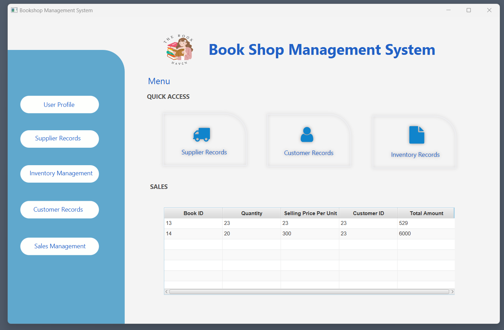

# Book-Shop-Management-System

Our desktop application for bookshop management
 simplifies essential tasks across sales, inventory,
 supplier, and customer management, offering a
 seamless, user-friendly interface for both staff and
 management. Designed to support the daily needs
 of bookshops, the application provides intuitive
 tools for recording sales, tracking stock levels,
 managing suppliers, and maintaining customer
 information, promoting smooth workflows and
 efficient organization.

 <h1>System Overview</h1>
 
The Book Shop Management System provides an
 integrated and easy-to-use platform to handle
 essential business processes, offering features
 that make managing a bookshop more efficient and
 less time-consuming.

 
<h3>Sales Management</h3> - Track all sales activities,
 including book titles, quantities sold, prices, and
 total amounts. The system automatically
 calculates the total sales amount based on
 entered quantities and unit prices, allowing for
 quick sales tracking and reporting. 
 

 
 
<h3>Inventory Management</h3> - Keep a real-time record of
 stock levels and products in the store. The system
 helps avoid stockouts by allowing quick updates on
 product availability, thus ensuring that the shop has
 sufficient stock to meet customer demand. It can
 also alert managers when it’s time to restock.

   
 
<h3>Supplier Records</h3> - Manage details of suppliers,
 including their contact information, supplied
 products, and pricing. This feature ensures
 smooth supplier management and enables
 efficient procurement practices, keeping the
 store stocked with the necessary items.

 
 
<h3>Customer Records</h3> - The system stores important
 customer information such as contact details,
 purchasing history, and preferences, helping the
 bookshop maintain strong relationships with
 customers. This allows for personalized service
 and better customer retention strategies.

 
 
<h3>User Profiles</h3> - Different users, including
 managers and employees, can access the system
 based on their roles and permissions. This
 ensures security and data integrity while
 allowing each user to access only the relevant
 parts of the system based on their responsibilities.
 
 
<h1>Key Features of the System</h1>
 
<h3>Real-Time Sales Tracking</h3> - Automatically
 calculates the total amount for each sale based
 on quantity and price per unit.

 
<h3>User-Friendly Interface</h3> - Simplified navigation
 and visually appealing design, with quick access
 to key features via a sidebar and interactive
 controls.

 
<h3>Efficient Stock Management</h3> - Real-time updates
 and alerts for low-stock items, helping avoid
 inventory shortages and overstocking.

 
<h3>Customizability</h3> - Tailored to meet the specific
 needs of the bookshop, the system can adapt as
 the business grows.

 <h2>Sign Up</h2>
 

 <h2>Sign In</h2>
 

 <h2>Menu</h2>
 

 <h2>User Profile</h2>
 

 <h2>Supplier Records</h2>
 

 <h2>Inventory Management</h2>
 

 <h2>Customer Records</h2>
 

 <h2>Sales Management</h2>
 
